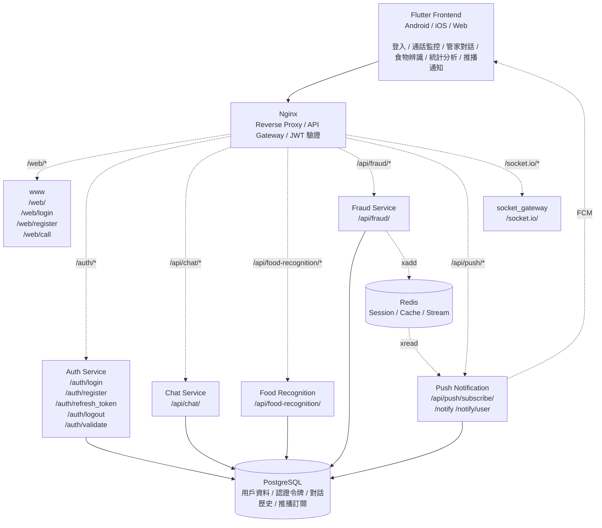

# AIO-Kebbi 智慧反詐騙與長者照護系統

AIO-Kebbi 是一款專為長者設計的智慧反詐騙保護與照護系統，結合 AI 語音對話、食譜識別等多元功能，為銀髮族提供全方位的數位保護與生活協助。

## 目錄

- [系統架構](#系統架構)
- [功能特色](#功能特色)
  - [智慧反詐騙通訊](#智慧反詐騙通訊-fraud-prevention)
  - [智慧管家對話助理](#智慧管家對話助理-chat-assistant)
  - [智慧食譜識別](#智慧食譜識別-recipe-recognition)
- [技術架構](#技術架構)
  - [後端服務](#後端服務)
  - [前端應用](#前端應用)
  - [基礎設施](#基礎設施)
- [快速開始](#快速開始)
  - [環境需求](#環境需求)
  - [後端部署](#後端部署)
  - [前端開發](#前端開發)
- [API 文件](#api-文件)
- [模型訓練](#模型訓練)

---

## 系統架構



---

## 功能特色

### 智慧反詐騙通訊 (Fraud Prevention)

**通話預判與語音分析**
- 在詐騙者撥打給被詐騙者之前，系統會自動攔截通話
- 即時將通話音頻流轉換為文字 (STT)，並啟動 LLM 判斷流程

**AI 詢問與快速判斷**
- 系統透過 AI 主動向來電者（可能為詐騙者）詢問通話事由
- AI 生成的應答文字即時轉化為語音 (TTS) 回傳給來電者，模擬真實通話體驗
- 在約 3 分鐘的通話時間內，LLM 綜合分析對話內容，快速判斷是否為詐騙行為

**智慧化處理決策**
- **詐騙確認**：系統自動中斷與詐騙者的通話
- **非詐騙確認**：自動將通話轉接至原被呼叫者，實現雙方正常通話

### 智慧管家對話助理 (Chat Assistant)

- 使用微調過的管家 LLM 作為機器人大腦，與老人進行自然對話
- **多輪對話管理**：維護對話上下文，進行連貫的多輪對話
- **語音互動**：LLM 生成的回應透過 TTS 技術清晰朗讀給用戶
- 理解用戶意圖並生成管家式回應，提供長者照護的社交陪伴品質

### 智慧食譜識別 (Recipe Recognition)

- **圖像與影片分析**：處理即時影片流或上傳的圖片幀，進行物體識別
- **食物檢測**：自動識別圖像中的食物種類
- **食譜推薦**：成功檢測到食物後，提供相關食譜並以 QR 碼形式展示

---

## 技術架構

### 後端服務

| 服務 | 語言 | 框架 | 說明 |
|------|------|------|------|
| `auth` | Python | FastAPI | JWT 認證服務 (PostgreSQL) |
| `chat` | Python | FastAPI | AI 對話 + 食物辨識 + TTS (OpenAI) |
| `fraud` | Python | FastAPI | GPT-4 反詐騙語音助理 |
| `socket_gateway` | Python | Flask-SocketIO | WebSocket 閘道 (Redis pub/sub) |
| `push_notification` | Python | FastAPI | FCM 推播通知 |
| `www` | Python | FastAPI + Jinja2 | 網頁介面 (Bootstrap 5) |

### 前端應用

| 項目 | 技術 |
|------|------|
| 框架 | Flutter |
| 狀態管理 | Provider |
| 依賴注入 | GetIt |
| 平台支援 | Android / iOS / Web |

**前端專案結構**
```
frontend/lib/
├── config/          # API 設定
├── constants.dart  # 全域常數
├── di/              # 依賴注入 (GetIt)
├── main.dart        # 應用程式入口
├── models/          # 資料模型
├── pages/           # 頁面元件
│   ├── login_page.dart
│   ├── menu_page.dart
│   ├── call_page.dart
│   ├── butler_chat_page.dart
│   ├── food_recognition_page.dart
│   └── ...
├── providers/       # 狀態管理
├── services/        # 商業邏輯層
│   ├── api_service.dart
│   ├── websocket_service.dart
│   ├── audio_service.dart
│   └── ...
└── widgets/         # 可重複使用元件
```

### 基礎設施

| 服務 | 用途 |
|------|------|
| Docker + Docker Compose | 容器化與部署 |
| Nginx | 反向代理、API Gateway、JWT 驗證 |
| PostgreSQL 18 | 關係型資料庫 (asyncpg 異步操作) |
| Redis | Session 管理、即時通訊 |
| OpenAI API | LLM 推理、TTS 語音合成 |

### Nginx 路由配置

| 路徑 | 目標服務 | 驗證 |
|------|----------|------|
| `/` | Flutter Web | 否 |
| `/web/` | www 服務 | 否 |
| `/auth/*` | auth 服務 | 否 |
| `/api/chat/*` | chat 服務 | JWT |
| `/api/fraud/*` | fraud 服務 | JWT |
| `/api/food-recognition/*` | food_detect 服務 | JWT |
| `/api/push/*` | push_notification 服務 | JWT |
| `/socket.io/*` | socket_gateway | WebSocket |

---

## 快速開始

### 環境需求

- **後端**：Docker, Docker Compose, NVIDIA GPU (可選)
- **前端**：Flutter SDK 3.x, Dart 3.x

### 後端部署

```bash
cd backend

# 複製環境變數範本
cp .env.example .env

# 編輯 .env 檔案，填入必要環境變數
# - JWT_SECRET_KEY
# - DB_USERNAME, DB_PASSWORD, DB_DATABASE_NAME
# - OPENAI_API_KEY
# - HF_TOKEN, GIT_AUTH_TOKEN (用於模型下載)
```

**環境變數說明**

```env
# JWT 設定
JWT_SECRET_KEY=<your-secret-key>
JWT_REFRESH_SECRET_KEY=<your-refresh-secret-key>
JWT_ALGORITHM=HS256
ACCESS_TOKEN_EXPIRE_MINUTES=15
REFRESH_TOKEN_EXPIRE_DAYS=7

# 資料庫
DB_HOST=db
DB_PORT=5432
DB_USERNAME=<username>
DB_PASSWORD=<password>
DB_DATABASE_NAME=<database>

# OpenAI
OPENAI_API_KEY=<your-openai-key>
TTS_MODEL=tts-1
VOICE_MODEL=alloy
OPENAI_MODEL=gpt-4o-mini

# 食物辨識 API
FOOD_API_URL=https://food.bestweiwei.dpdns.org
```

**啟動服務**

```bash
# 生產環境
docker compose up --build

# 開發環境 (熱重載)
docker compose -f docker-compose.dev.yml up --build
```

服務運行於 **http://localhost:8100**

### 前端開發

```bash
cd frontend

# 安裝依賴
flutter pub get

# 執行
flutter run

# 執行於特定平台
flutter run -d android
flutter run -d ios
flutter run -d chrome
```

**測試與分析**

```bash
flutter test
flutter analyze
```

---

## API 文件

### 認證 API

| 方法 | 路徑 | 說明 |
|------|------|------|
| POST | `/auth/register` | 使用者註冊 |
| POST | `/auth/login` | 使用者登入 |
| POST | `/auth/refresh` | 刷新 Token |
| POST | `/auth/logout` | 登出 |
| GET | `/auth/validate` | 驗證 Token (內部) |

### 反詐騙 API

| 方法 | 路徑 | 說明 |
|------|------|------|
| POST | `/api/fraud/start_detection` | 啟動詐騙偵測 |
| POST | `/api/fraud/process_audio` | 處理音頻流 |
| POST | `/api/fraud/decision` | 取得偵測決策 |
| POST | `/api/fraud/hangup` | 掛斷電話 |

### 管家對話 API

| 方法 | 路徑 | 說明 |
|------|------|------|
| POST | `/api/chat/message` | 發送訊息 |
| GET | `/api/chat/history` | 取得對話歷史 |

### 食物辨識 API

| 方法 | 路徑 | 說明 |
|------|------|------|
| POST | `/api/food-recognition/detect` | 識別食物種類 |

---

## 模型訓練

### 管家對話模型 (Chat Model)

**資料集建構**
- 使用 Llama-3.1-70B-Instruct (AWQ INT4) 作為教師模型
- 透過多意圖、多情境的提示詞模板合成生成 5,000 筆對話數據
- GPT-5 依「語氣」與「合理性」兩大維度自動篩選，最終取得 4,192 筆高品質訓練資料

**模型微調**
- 基底模型：Llama-3.1-8B-Instruct
- 訓練策略：QLoRA (4-bit NF4 量化、LoRA rank=16)
- 僅對 assistant token 計算 loss，訓練 4 個 epochs

**評估結果**
- 驗證集準確率：65.35% → 82.05% (+16.7 pp)

### 詐騙檢測模型 (Fraud Detection Model)

**評估指標**
- 「衰減加權準確率」(DWA)：結合長度衰減權重與類別成本權重
- 偏好短對話即能正確判斷的模型
- 賦予詐騙樣本更高權重

**資料集**
- 韓文語音詐騙轉錄資料集 (1,377 份)
- NLLB-200 翻譯為英文
- GPT-5.2 語意與標註一致性檢核
- 最終保留 1,213 份樣本 (VP 228 筆、NonVP 985 筆)

**模型微調**
- 基底模型：Llama-3.1-8B-Instruct
- 訓練策略：LoRA 參數高效微調

**評估結果**
- 微調後 DWA 達 0.9780
- 優於 Llama-3.1-70B-Instruct (0.9062)、GPT-OSS-120B (0.7966) 等大量級模型
- 訓練約 100 步即達收斂

---

## License

MIT License
